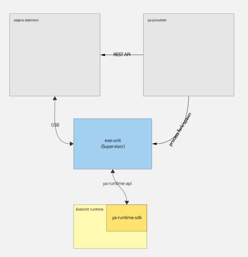

# Provider architecture

Golem's architecture is based on a modular design with the aim of providing decoupled and
replaceable components. The primary building block is the Provider Agent application (ya-provider),
which can be extended using pluggable ExeUnits.

ExeUnits are responsible for executing Requestors' code. Although conceptually similar to
virtual machines, ExeUnits offer a broader range of utility.

## Interactions 

Provider application consists of following components:
- Yagna daemon: It serves as the entry point to the Golem Network, providing APIs for communication
between Nodes, handling market interactions, executing computations, and managing payments.
It exposes a REST API for agent applications.
- Provider agent: This component is responsible for implementing the provider's business logic.
It handles negotiation of Agreements on the market, spawns ExeUnits, and manages invoicing
and payment reception.
- ExeUnit Supervisor: The ExeUnit Supervisor controls the ExeUnit Runtime and facilitates
communication with the Yagna daemon.
- ExeUnit Runtime: This component is the implementation-specific part of the execution environment.

